# Оглавление

1. [Примеры кода](#примеры-кода)
2. [Семантический анализ и построение AST](#семантический-анализ-и-построение-ast)
    *   [Типы узлов AST](#типы-узлов-ast)
    *   [Таблица символов и управление окружением](#таблица-символов-и-управление-окружением)
    *   [Архитектура обработчиков (Handlers)](#архитектура-обработчиков-handlers)
    *   [Диагностика ошибок](#диагностика-ошибок)
3. [Архитектура и устройство компилятора](#архитектура-и-устройство-компилятора)
    *   [Управление памятью и представление данных](#управление-памятью-и-представление-данных)
    *   [Лямбда-выражения и замыкания](#лямбда-выражения-и-замыкания)
    *   [Компоненты системы](#компоненты-системы)
4. [Unit тестирование](#unit-тестирование)
5. [Интерфейс командной строки (CLI)](#интерфейс-командной-строки-cli)
6. [Результаты запуска программ](#результаты-запуска-программ)


---

# Примеры кода

Ниже приведены фрагменты кода на Lisp, на которых проводилось тестирование и демонстрация возможностей компилятора.
<details>
<summary><b>1. DFS (Поиск в глубину в графе)</b></summary>
<br>
Этот пример демонстрирует работу со списками, рекурсией и функциями высшего порядка при обходе графа.

```lisp
;; === УТИЛИТЫ ===

;; Проверка вхождения элемента в список
(defun member (x lst)
  (cond
    ((eq lst nil) nil)
    ((= x (car lst)) t)
    (t (member x (cdr lst)))))


;; Получение соседей узла из графа (Assoc List)
(defun get-neighbors (node graph)
  (cond
    ((eq graph nil) nil)
    ((= node (car (car graph))) (cdr (car graph)))
    (t (get-neighbors node (cdr graph)))))


;; Реверс списка
(defun reverse-helper (lst acc)
  (cond
    ((eq lst nil) acc)
    (t (reverse-helper (cdr lst) (cons (car lst) acc)))))

(defun reverse (lst)
  (reverse-helper lst nil))


;; === DFS ===

(defun try-neighbors (neighbors target visited graph)
  (cond
    ((eq neighbors nil) nil)
    (t
     (let ((res (dfs (car neighbors) target visited graph)))
       (if (not (eq res nil))
           res
           (try-neighbors (cdr neighbors) target visited graph))))))


(defun dfs (current target visited graph)
  (cond
    ((= current target) (list target))
    ((member current visited) nil)
    (t
     (let ((path (try-neighbors (get-neighbors current graph)
                                 target
                                 (cons current visited)
                                 graph)))
       (if (not (eq path nil))
           (cons current path)
           nil)))))


;; === UI ===

;; Вспомогательная функция: просто печатает узлы и стрелочки
(defun print-nodes (p)
  (cond
    ((eq p nil) (princ "\n")) ;; Конец списка -> просто перенос строки
    (t
     (progn
       (print (car p))
       (if (not (eq (cdr p) nil)) (princ " -> "))
       (print-nodes (cdr p))))))

;; Основная функция печати: проверяет наличие пути перед печатью
(defun print-path (p)
  (cond
    ((eq p nil) (princ "No path found.\n")) ;; Если пришел nil сразу -> пути нет
    (t (print-nodes p))))                   ;; Иначе печатаем узлы


(defun main ()
  (progn
    (setq graph
          (list
           (list 1 2 3)
           (list 2 4)
           (list 3 4 5)
           (list 4 2 6)
           (list 5 6)
           (list 6)))

    (princ "Defined Graph Edges:\n")
    (princ "1 -> [2, 3]\n2 -> [4]\n3 -> [4, 5]\n4 -> [2, 6]\n5 -> [6]\n")

    (princ "\n--- DFS Search from 1 to 6 ---\n")

    (let ((result (dfs 1 6 nil graph)))
      (print-path result))

    (princ "\nDone.")
  ))

(main)
```
</details>

<details>
<summary><b>2. Map, Filter и Range (Функциональное программирование)</b></summary>
<br>
Демонстрация работы с лямбда-выражениями (анонимными функциями) и передачей функций в качестве аргументов.

```lisp
;; Генерация списка чисел от MIN до MAX
(defun range (min max)
  (if (> min max)
      nil
      (cons min (range (+ min 1) max))))

;; Map: применяет функцию F к каждому элементу списка
(defun map (f lst)
  (if (eq lst nil)
      nil
      (cons (funcall f (car lst))
            (map f (cdr lst)))))

;; Filter: возвращает элементы, удовлетворяющие PRED
(defun filter (pred lst)
  (cond
    ((eq lst nil) nil)
    ((funcall pred (car lst))
     (cons (car lst)
           (filter pred (cdr lst))))
    (t (filter pred (cdr lst)))))

;; Печать списка
(defun print-list (lst)
  (cond
    ((eq lst nil) (princ "\n"))      ;; Если список пуст - просто перевод строки
    (t (progn
         (print (car lst))           ;; Печатаем число
         (if (eq (cdr lst) nil)      ;; Если это последний элемент...
             nil                     ;; ... ничего не делаем
             (princ " "))            ;; ... иначе печатаем пробел-разделитель
         (print-list (cdr lst))))))  ;; Рекурсия

;; --- Основная программа ---
(defun start ()
  (progn
    (princ "Generating numbers from 1 to 10...\n")
    (setq numbers (range 1 10))
    (print-list numbers)

    (princ "Filtering even numbers...\n")
    (setq filtered (filter (lambda (x) (> x 4)) numbers))
    (print-list filtered)

    (princ "Squaring the filtered numbers...\n")
    (setq squared (map (lambda (x) (* x x)) filtered))
    (print-list squared)

    (princ "Done.\n")))

(start)
```
</details>

<details>
<summary><b>3. Генерация перестановк (FlatMap и комбинаторика)</b></summary>
<br>
Пример сложной рекурсии и манипуляции списками списков.

```lisp
;; === ВСПОМОГАТЕЛЬНЫЕ ФУНКЦИИ ===

;; Объединение двух списков
(defun append (l1 l2)
  (cond
    ((nil l1) l2)
    (t (cons (car l1) (append (cdr l1) l2)))))

;; Map: применяет функцию f к списку
(defun map (f lst)
  (cond
    ((nil lst) nil)
    (t (cons (funcall f (car lst)) (map f (cdr lst))))))

;; FlatMap: делает map, а потом склеивает результаты (append)
(defun flatmap (f lst)
  (cond
    ((nil lst) nil)
    (t (append (funcall f (car lst)) (flatmap f (cdr lst))))))

;; Удаление элемента x из списка lst
(defun remove (x lst)
  (cond
    ((nil lst) nil)
    ((= x (car lst)) (remove x (cdr lst))) ;; Удаляем (пропускаем)
    (t (cons (car lst) (remove x (cdr lst))))))

;; Генерация списка [start ... end]
(defun range (start end)
  (cond
    ((> start end) nil)
    (t (cons start (range (+ start 1) end)))))

;; === ОСНОВНАЯ ЛОГИКА ===

;; Генерация перестановок
(defun perms (lst)
  (cond
    ((nil lst) (list nil)) ;; Базовый случай: список (nil)
    (t
     ;; flatmap проходит по каждому элементу x из lst
     (flatmap (lambda (x)
                ;; Внутренняя map берет перестановки хвоста и добавляет x
                (map (lambda (p) (cons x p))
                     (perms (remove x lst))))
              lst))))

(defun print-row (lst)
  (progn
    (princ "[ ")
    (map (lambda (x) (progn (print x) (princ " "))) lst)
    (princ "]\n")))

(defun main ()
  (progn
    (princ "Enter number of elements (N): ")
    (setq n (read))

    (princ "Generating permutations for list of size ")
    (print n)
    (princ "...\n")

    ;; Создаем список (1 2 ... N)
    (setq my-list (range 1 n))

    ;; Вычисляем перестановки
    (setq result (perms my-list))

    ;; Выводим результат
    (map (lambda (row) (print-row row)) result)

    (princ "Done.\n")))

(main)
```
</details>

<details>
<summary><b>4. Рисование круга в консоли (ASCII Graphics)</b></summary>
<br>
Пример математических вычислений и использования вложенных циклов (через рекурсию) для вывода графики.

```lisp
;; --- Рисование круга в консоли ---

;; Вычисление квадрата числа
(defun square (x) (* x x))

;; Проверка, находится ли точка (x, y) внутри круга радиуса r
;; x^2 + y^2 <= r^2
(defun is-inside (x y r)
  (<= (+ (square x) (square y)) (square r)))

;; Цикл по X (от -R до R) для текущей строки Y
(defun loop-x (x end-x y r)
  (cond
    ((> x end-x) (princ "\n")) ;; Конец строки
    (t (progn
         ;; Немного корректируем пропорции терминала (X * 0.5 для визуальной круглости)
         (cond
           ((is-inside x y r) (princ "**"))
           (t (princ "  ")))
         (loop-x (+ x 1) end-x y r)))))

;; Цикл по Y (от -R до R)
(defun loop-y (y end-y r)
  (cond
    ((> y end-y) t) ;; Конец рисования
    (t (progn
         (loop-x (* r -1) r y r)
         (loop-y (+ y 1) end-y r)))))

(defun main ()
  (progn
    (princ "Drawing a circle with radius 8:\n")
    (loop-y -8 8 8)
    (princ "\nDone.")
  ))

(main)
```
</details>

---

# Семантический анализ и построение AST

Модуль семантического анализа преобразует сырое дерево разбора (Parse Tree), полученное от парсера ANTLR, в типизированное абстрактное синтаксическое дерево (AST). Класс `SemanticAnalyzer` наследует `lispVisitor` и выполняет рекурсивный обход узлов.

В отличие от синтаксического разбора, данный этап работает со смысловой нагрузкой кода: проверяет существование переменных, валидирует сигнатуры вызовов и, что критически важно, формирует карту памяти для будущего этапа компиляции.

## Типы узлов AST

Результирующее дерево строится из строго типизированных структур (dataclasses), каждая из которых представляет конкретную семантическую конструкцию:

*   **Литералы:** `NumberNode`, `StringNode`, `NilNode`, `TrueNode` и `SymbolNode`.
*   **Списки и вызовы:** `ListNode` для структур данных и `CallNode` для вызова пользовательских функций. Встроенные примитивы (например, `+` или `cons`) оборачиваются в специализированный `PrimCallNode`, что упрощает их трансляцию в нативные инструкции WASM.
*   **Управляющие конструкции:** `CondNode` (хранит список пар «условие-тело»), `PrognNode` (последовательное выполнение).
*   **Определения:** `DefunNode` и `LambdaNode`. Последний сохраняет не только параметры и тело, но и ссылку на захваченное лексическое окружение.

## Таблица символов и управление окружением

Ключевым компонентом анализа является класс `Environment`, реализующий иерархическую структуру областей видимости. Каждый экземпляр окружения хранит ссылку на родителя (`parent`), образуя цепочку от текущего блока до глобального контекста.

Информация об идентификаторах инкапсулирована в класс `SymbolInfo`. Помимо метаданных (флаги `is_function`, `is_primitive`), он содержит данные, определяющие физическое расположение переменных в памяти:
*   `env_level`: Глубина вложенности (0 для глобального уровня, 1+ для локальных).
*   `var_index`: Порядковый номер переменной внутри текущего кадра стека.

### Расчет смещений (Layout)
При определении переменной через метод `define` анализатор проверяет уровень вложенности. Если переменная локальная, ей присваивается уникальный инкрементальный индекс `var_index`. Фактически, именно на этапе семантического анализа определяется раскладка стекового кадра (Stack Frame Layout). Этот индекс впоследствии используется генератором кода для вычисления точного смещения в байтах относительно начала фрейма в куче.

### Разрешение имен
Метод `resolve` реализует поиск идентификатора: сначала в текущей таблице символов, затем рекурсивно в родительских окружениях. Это позволяет корректно идентифицировать свободные переменные (free variables), которые необходимо захватить в замыкание.

## Архитектура обработчиков (Handlers)

Логика анализа разбита на независимые модули, наследующие `SpecialFormHandler`. Главный класс анализатора выступает диспетчером: при встрече списка, начинающегося с ключевого слова (например, `cond` или `defun`), управление передается соответствующему компоненту.

Примеры реализации логики:
*   **SetqHandler:** Проверяет типы аргументов и регистрирует переменную в текущем окружении, если она не была определена ранее.
*   **LambdaHandler и DefunHandler:** Управляют созданием новых областей видимости. Перед анализом тела функции создается новый `Environment`, в котором регистрируются параметры аргументов. Результатом становится узел AST, хранящий ссылку на это окружение.
*   **LetHandler:** Реализует конструкцию `let` через трансформацию AST (Desugaring). Вместо создания специфического узла, обработчик преобразует `let` в вызов анонимной функции (IIFE). Список связываний трансформируется в параметры и аргументы `CallNode`, обертывающего `LambdaNode`.

Для обработки цитируемых данных (`quote`) используется отдельный класс `QuoteBuilder`, который строит структуру AST без выполнения семантических проверок, трактуя содержимое как данные, а не как код.

## Диагностика семантических ошибок

Система валидации построена на классе `ErrorCollector`, который накапливает ошибки без прерывания процесса анализа. Это позволяет выявить множество проблем за один проход.

#### 1. Проверка арности (Arity Checks)
Многие специальные формы требуют строгого количества аргументов. Если пользователь передает неверное число параметров, генерируется `ArityError`.
*   **Quote (`'`)**: Ожидает ровно 1 аргумент.
    *   *Пример:* `(quote 1 2)` → Ошибка: `expected 1 argument, got 2`.
*   **Setq**: Ожидает ровно 2 аргумента (имя переменной и значение).
    *   *Пример:* `(setq x)` → Ошибка: `expected 2 arguments`.
*   **Defun**: Требует минимум 3 элемента: имя, список параметров и тело.
*   **Let/Lambda**: Требуют как минимум список связываний или параметров.

#### 2. Проверка типов узлов AST (Type Mismatch)
Даже если синтаксис Lisp-списков соблюден (`(...)`), семантика может быть нарушена использованием неверных типов данных в ключевых позициях. `TypeMismatchError` возникает, когда обработчик ожидает конкретный тип узла (например, `SymbolNode`), а получает другой (например, `NumberNode` или `ListNode`).

*   В конструкциях `defun`, `setq` и в связываниях `let` первым элементом обязан быть Символ.
*   В `let` первым аргументом обязан быть список (или `nil`), а не атом.
   

#### 3. Структурная валидация (Invalid Syntax)
Сложные конструкции, такие как `cond` и `let`, накладывают ограничения на внутреннюю структуру своих аргументов. Нарушение "формы" внутри правильного Lisp-списка вызывает `InvalidSyntaxError`.

*   Каждое связывание внутри `let` должно быть парой `(var value)`.
   
*   Каждая ветка условия `if` должна быть списком `(predicate body...)`.
   
### Контекстная трассировка (Context Stack)

Для упрощения отладки вложенных выражений используется менеджер контекста `analyzer.collector.context(...)`. Это позволяет видеть путь сверху вниз к ошибке.

Например, при ошибке внутри сложной функции `calculate`:
```python
with analyzer.collector.context(f"Function '{func_name}'"):
    # ... анализ тела ...
```
Если внутри тела встретится ошибочный `cond`, сообщение об ошибке будет содержать стек:
> **Error:** TypeMismatchError inside `Function 'calculate'` -> `Cond Clause #2` -> `Let Binding #1`

### Демонстрация обнаружения ошибок

Ниже приведены результаты работы семантического анализатора на тестовых файлах с ошибками. Для каждого примера указана ссылка на исходный код и скриншот с выводом компилятора.

**1. Неверное количество аргументов (Arity Error: Setq)**
Попытка вызова `setq` с одним аргументом вместо двух.
> [Исходный код: setq.lisp](examples/examples_with_semantic_errors/setq.lisp)

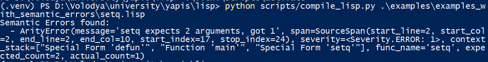

---

**2. Неверное количество аргументов (Arity Error: Quote)**
`quote` принимает ровно одно выражение, здесь передано два.
> [Исходный код: quote.lisp](examples/examples_with_semantic_errors/quote.lisp)

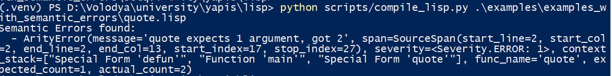

---

**3. Неполное определение функции (Arity Error: Defun)**
Отсутствует тело функции (переданы только имя и параметры).
> [Исходный код: defun.lisp](examples/examples_with_semantic_errors/defun.lisp)

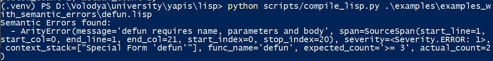

---

**4. Несоответствие типов (Type Mismatch: Setq)**
Попытка присвоить значение числу, а не символу (переменной).
> [Исходный код: type_mismatch.lisp](examples/examples_with_semantic_errors/type_mismatch.lisp)

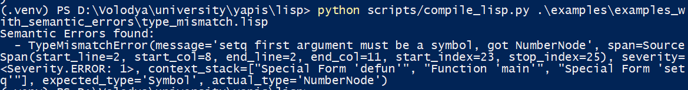

---

**5. Неверное имя функции (Type Mismatch: Defun)**
Имя функции задано строкой `"add-two"`, хотя ожидается символ (Symbol).
> [Исходный код: wrong_func_name.lisp](examples/examples_with_semantic_errors/wrong_func_name.lisp)

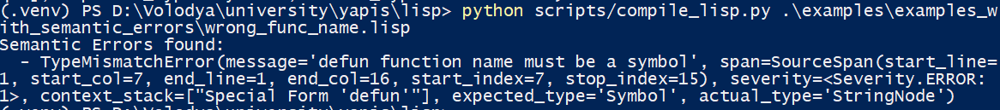

---

**6. Структурная ошибка (Invalid Syntax: Let)**
Нарушение структуры списка связываний внутри `let` (некорректное количество элементов в паре).
> [Исходный код: let.lisp](examples/examples_with_semantic_errors/let.lisp)

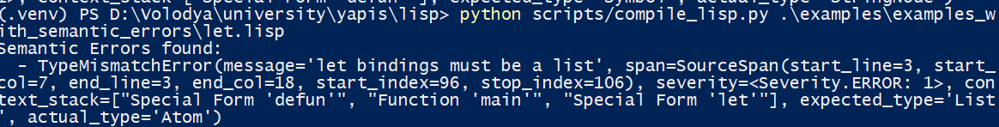

---

**7. Ошибка в лямбда-выражении**
Демонстрация ошибки при некорректном объявлении анонимной функции.

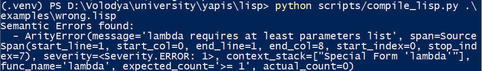
---

# Архитектура и устройство компилятора

Компилятор представляет собой модульный транслятор AST → WAT, реализующий паттерн Visitor. Процесс трансляции сохраняет двухфазный подход (сканирование определений и генерация кода), но внутренняя структура была подвергнута глубокому рефакторингу для устранения антипаттерна "God Object" и повышения поддерживаемости кода.

Архитектура построена на **декомпозиции ответственности**: класс `WasmCompiler` выступает в роли высокоуровневого фасада и диспетчера, делегируя конкретную логику генерации кода специализированным обработчикам (**Handlers**). Изменяемое состояние (таблицы символов, счетчики, флаги) изолировано в классе `CompilerContext`.

## Управление памятью и представление данных

Система типов унифицирована: все значения Lisp (числа, логические значения, указатели) передаются как `f64`. При работе с памятью применяются строгие типизированные константы и явные преобразования (`f64` ↔ `i32`) через `OpCode.TRUNC_U` и `OpCode.CONVERT_U`, что исключает использование "магических строк" в коде генерации.

Модель памяти опирается на последовательное выделение (bump pointer allocation). Глобальная переменная `$heap_ptr` указывает на свободную область. Константы разметки памяти (размер машинного слова, заголовки объектов) вынесены в статический класс `MemoryLayout`.

Структуры данных в куче:
*   **Cons-ячейка:** 16 байт (два слова по 8 байт).
*   **Строка:** 4 байта длины (`i32`) + тело строки (UTF-8 байты).
*   **Фрейм окружения:** Блок памяти, хранящий ссылку на родительское окружение (Static Link) и значения локальных переменных.

## Лямбда-выражения и замыкания

Поддержка функций первого класса реализована через передачу окружения. Любая функция (именованная или анонимная) компилируется в процедуру WASM, принимающую скрытый аргумент `$env`.

### Доступ к переменным
Логика доступа к переменным полностью инкапсулирована в `FramePolicy` и `VariableHandler`. Компилятор статически рассчитывает "расстояние" до переменной (разницу уровней вложенности). Если переменная находится в замыкании, `FramePolicy` генерирует цепочку инструкций для прохода по ссылкам родительских фреймов в куче, скрывая от основной логики низкоуровневую арифметику указателей.

В рантайме замыкание — это пара (cons-ячейка):
*   `car`: индекс функции в таблице `Table`.
*   `cdr`: указатель на захваченное окружение.

Вызовы осуществляются через `call_indirect`. Динамическая проверка сигнатур обеспечивается через `TypeRegistry`, который регистрирует типы функций "на лету".

## Компоненты системы

### WasmCompiler (Facade)
Точка входа и диспетчер. Он реализует интерфейс `ASTVisitor`, но не содержит логики генерации кода. Его задача — маршрутизировать узлы AST в соответствующие хендлеры и собрать итоговый модуль из секций.

### CompilerContext
Центральное хранилище состояния. Содержит:
*   `Environment` (текущие области видимости).
*   `TypeRegistry` (реестр сигнатур функций).
*   Списки глобальных переменных и таблицу функций (`table_entries`).
*   Ссылки на активные хендлеры для перекрестного взаимодействия.

### Handlers (Обработчики)
Группа классов, разделяющих логику компиляции по доменным областям:
*   **`FunctionHandler`**: Отвечает за `defun`, `lambda` и вызовы функций (`call`). Управляет генерацией пролога функции, аллокацией фреймов и созданием замыканий.
*   **`ControlFlowHandler`**: Генерация управляющих конструкций: `if`, `cond`, логических операторов (`and`/`or`) и блоков `progn`.
*   **`VariableHandler`**: Обработка чтения (`SymbolNode`) и записи (`SetqNode`) переменных. Взаимодействует с `FramePolicy` для вычисления адресов.
*   **`ValueHandler`**: Генерация кода для литералов: чисел, строк, списков и квотированных выражений (`quote`).

### FramePolicy
Абстракция над физическим устройством стекового кадра в куче. Отвечает за:
*   Расчет размера фрейма.
*   Вычисление смещений (offset) для переменных.
*   Генерацию WAT-кода для доступа к переменным по цепочке статических ссылок (static chain traversal).

### WasmStdLib
Статическая библиотека времени исполнения (Runtime). Реализует базовые примитивы, которые невозможно или неэффективно выразить чистым байт-кодом на каждом шаге: аллокация памяти (`$std_cons`), доступ к спискам (`$std_car`, `$std_cdr`), глубокое сравнение (`$std_equal`) и конкатенация строк.

### WasmTypes & OpCodes
Набор констант и перечислений (Enum), заменяющий использование строковых литералов. Гарантирует строгую типизацию инструкций генератора (например, использование `OpCode.ADD` вместо строки `'f64.add'`).

### WatBuilder
Инструмент для генерации S-выражений. Предоставляет удобный API для эмиссии инструкций и управления вложенностью блоков (`if`, `block`, `loop`) через контекстные менеджеры Python (`with wb.if_block(): ...`).


# Unit тестирование

Для обеспечения надежности компилятора и семантического анализатора реализован набор unit тестов с использованием фреймворка `pytest`. 

И тесты семантического анализа и тесты компилятора имеют базовый класс, содержащий основные функции тестирвоания, остальные классы в основном нужны для передачи тестового кода и выполнения asser команд.

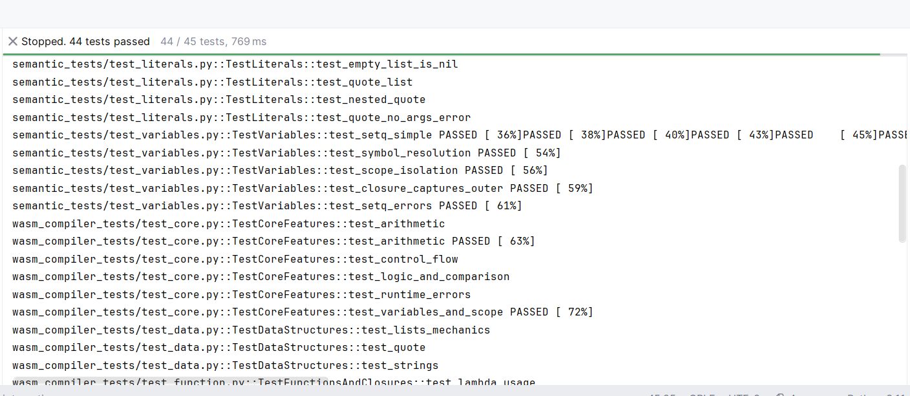

# Интерфейс командной строки (CLI)

Для удобного взаимодействия с компилятором реализован CLI-интерфейс на базе библиотеки **click**. Он позволяет компилировать файлы в формат WAT или сразу запускать их на исполнение.

### Компиляция 
Транслирует исходный Lisp-файл в текстовое представление WebAssembly (.wat).

```bash
python -m scripts.cli compile <путь_к_файлу> -o <выходной_файл>
```

**Пример:**
```bash
python -m scripts.cli compile .\examples\lamda_examples.lisp -o .\examples\lamda_examples.wat
```

### Запуск 
Выполняет полный цикл: парсинг, семантический анализ, компиляция и мгновенное выполнение кода через встроенный WASM-рантайм.

```bash
python -m scripts.cli run <путь_к_файлу>
```

**Пример:**
```bash
python -m scripts.cli run .\examples\lamda_examples.lisp
```


# Результаты запуска программ

Ниже приведены скриншоты выполнения тестовых примеров. Для каждого примера указана ссылка на исходный код.

### 1. Поиск в глубину 
**Исходный код:** [examples/dfs.lisp](examples/dfs.lisp)

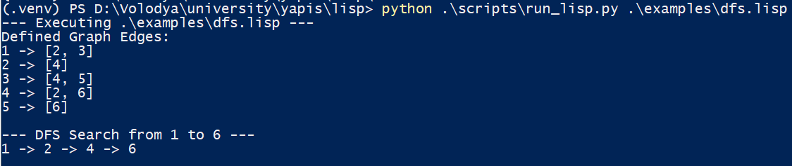

---

### 2.Использование лямбда функций (Map, Filter)
**Исходный код:** [examples/lamda_examples.lisp](examples/lamda_examples.lisp)

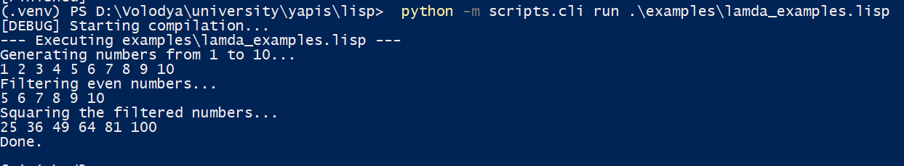
---

### 3. Генерация перестановок
**Исходный код:** [examples/permitations.lisp](examples/permitations.lisp)

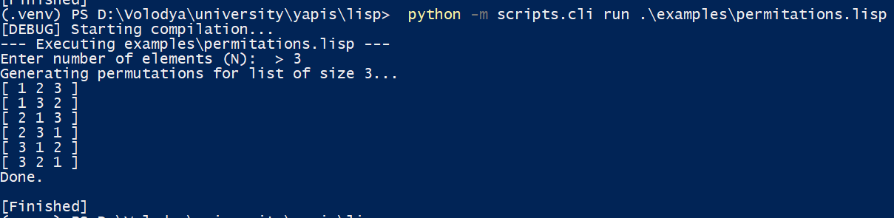

---

### 4. Рисование круга (ASCII)
**Исходный код:** [examples/circle.lisp](examples/circle.lisp)

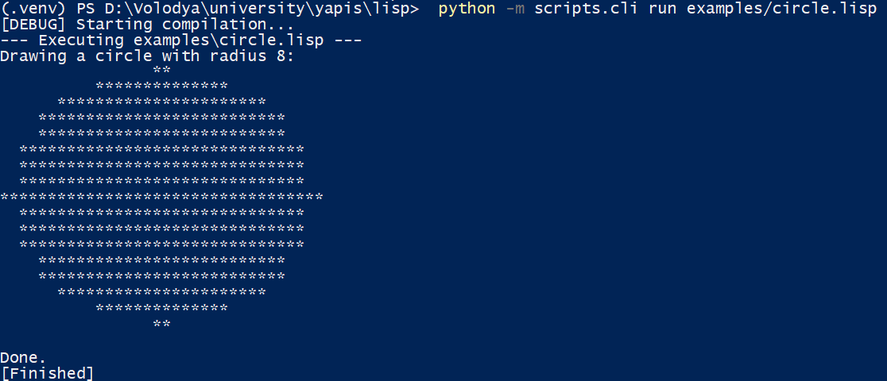